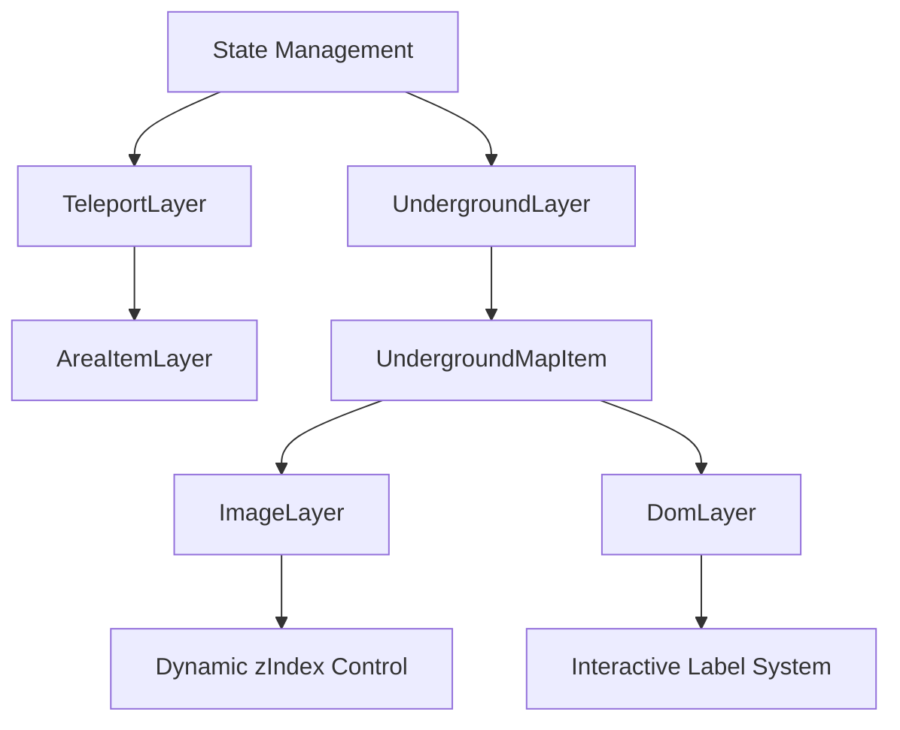

Kongying Tavern Genshin Map
A super-smooth interactive map for Genshin Impact. Data source: Kongying Tavern.

Online Demos:

https://qiuxiang.github.io/ky-genshin-map/ (GitHub Pages)

https://ky-genshin-map-1253179036.cos-website.ap-nanjing.myqcloud.com (Tencent Cloud COS)

📱 Mobile Compatibility
Fully responsive and smooth experience on mobile browsers as well.

🔧 Build Instructions
bash
复制
编辑
# Initialize
pnpm run init

# Start development server
pnpm run dev

# Build for production
pnpm run build
✅ TODO List
 Highlight markers on the same layer (same floor) like in Genshin's official layered map

 Improve display of region and subregion names

 Support import/export of save data

<!-- by 陈俊豪 --> 
陈俊豪
Perform bug analysis and English comment translation for the following components:

1. ActiveMarkerLayer (Active Marker Layer)
Purpose: Displays the currently selected marker and its detailed information.

Load and render the designated marker icon (active-marker.png)

Show marker title, content, images, etc.

Support toggling "Incomplete / Completed" status (using Valtio for state management)

2. AreaItemLayer (Area Item Layer)
Purpose: Displays all resource points or special locations on the map.

Requirements:

Render markers by region type and whether they are aboveground/underground

Use MarkerLayer to show points, with support for icons and underground tags

Optionally exclude the currently active marker and completed markers

3. AreaNamesLayer (Area Name Layer)
Purpose: Displays major/subregion names on the map in Chinese.

Dynamically show/hide different name layers based on map zoom level

Use TextLayer with a custom font to render Chinese text

Support management of main and subregion name lists

<!-- by 宋治钱 --> 
宋治钱
I have been working on the first three parts of [components] and [drawer]. In [components], it implements a graphical toggle switch, which is commonly used to switch between two states, such as turning on or off a certain feature. The functionality of [drawer][area-item-types.tsx] is that they are used to render and manage a list of area item types. These components are typically used to build user interfaces where users can view and select different types of area items. [area-items.tsx] allows users to activate or deactivate an entire group of area items by clicking. It provides visual feedback, indicating the activation status of the area items through changes in background and text color. It displays the name and quantity of the area items to help users identify and manage different area items. [index.tsx] provides a collapsible sidebar that users can control the display status of by clicking a toggle button. The sidebar can contain various content, such as a list of area item types, from which users can make selections and perform operations.

<!-- by 覃冰棱 -->
覃冰棱
### 1. **index.ts**
This code implements a visualization component for the _Genshin Impact_ game map, using CanvasKit for efficient map rendering.
- **Map Container**: Uses `CanvaskitMap` as the map container.
- **Tile Loading**: Loads and displays map tiles using `TileLayer`.
- **Interaction**: Supports panning and zooming interactions.
- **Layered Rendering System**: 
  - **Architecture**: Uses a layered architecture where different elements are placed on different layers.
  - **Order Control**: Controls the display order of layers using `zIndex`.
- **Dynamic Content Management**:
  - **Data and Configuration**: Retrieves map data and settings from the global state `store`.
  - **Dynamic Rendering**: Dynamically renders active area items.

### 2. **mask-layer.ts**
This code implements a black semi-transparent mask layer, primarily used to create a visual mask effect on the map.
- **Mask Effect Implementation**: Creates a black semi-transparent rectangle that covers the entire map area.
- **Layer Management**:
  - **Inheritance**: Inherits from the base `Layer` class.
  - **Z-index Setting**: Sets the `zIndex` to `underground` to ensure it is displayed above the base map but below other content layers.

### 3. **settings.tsx**
This code defines a React component called `Settings`, which creates a settings panel that allows users to control the visibility of certain features using switches.
- **Settings Panel**:
  - **Layered Map**: Controls whether the layered map feature is enabled.
  - **Teleport Points**: Controls the visibility of teleport points.
  - **Markers**: Controls the visibility of marked content.
- **Usage**: This component is likely used in a map application or similar application to allow users to customize the content displayed on the map.

### 4. **shadow-layer.ts**
This code defines a custom shadow layer and encapsulates it as a React component (`ShadowLayer`).
- **Gradient Shadow Effect**: Used to draw a gradient shadow effect on the map.

<!-- by 覃旗广 -->
覃旗广
Here is the English translation of your explanation:

---

### Explanation of `state.ts` to `underground-layer.tsx`

#### **`state.ts`**  
This code implements the core state management and interaction functionality for an interactive map application. Its main purposes are:  

1. **Global State Management**  
   *Purpose*: Uses Valtio to create reactive global states, managing map instances, view states, and user data.  

2. **Map Event Handling**  
   *Purpose*: Processes map load events and click interactions, maintaining map instances and interaction states.  

3. **Marker Management System**  
   *Purpose*: Implements marker bookmarking/unbookmarking with `localStorage` for persistent user data storage.  

4. **Data Import/Export**  
   *Purpose*: Provides JSON export/import functionality for user marker data.  

5. **Underground Map Linkage**  
   *Purpose*: Automatically switches to the corresponding underground map when clicking a marker with underground layer data.  

6. **View Controls**  
   *Purpose*: Controls the visibility of underground layers, teleport points, and other map elements.  

---

#### **`underground-layer.tsx` & Related Components**  
These two files together form the core visualization components of a game map system, implementing the following features:  

1. **Multi-Layered Map Rendering System**  
   - `TeleportLayer`: Handles surface teleport points (including special "Statue of The Seven" markers).  
   - `UndergroundLayer`: Manages hierarchical structures of underground maps.  
   - Seamless switching between surface and underground maps (via `undergroundEnabled` state).  

2. **Smart Display Control**  
   - Progressive loading based on zoom level (`zoomLevel`):  
     - Statues of The Seven hide when `zoom < -4`.  
     - Regular teleport points hide when `zoom < -2`.  
     - Underground map labels hide when `zoom < -2` and inactive.  
   - Visual emphasis mechanisms:  
     - Currently selected underground maps (`current`) are highlighted (`zIndex + 1`).  
     - Inactive underground layers are semi-transparent (`opacity: 0.3`).  

3. **Interactive Map Marker System**  
   - Categorizes different teleport types (Statues of The Seven vs. regular teleporters).  
   - Click interactions for underground map labels (switching active layers).  
   - Dynamic state management (via Valtio’s `useSnapshot` for reactivity).  

4. **Performance Optimization**  
   - Uses `useMemo` to cache map chunks and label rendering.  
   - On-demand rendering (controlled by `teleportVisible`).  
   - Virtual DOM layer management (via `DomLayer`).  

5. **Visual Hierarchy Management**  
   - Precise `zIndex` control (base layer: `zIndex.underground`).  
   - `MaskLayer` for smooth transitions during map switching.  
   - Responsive styling (dynamic CSS classes via `classNames`).  

---

### **Typical Workflow**  
1. When the user zooms, the system automatically adjusts visible content.  
2. Clicking a teleport activates the linked underground map (via `activateMarker`).  
3. Underground maps display hierarchical labels, clickable for layer switching.  
4. The system automatically handles:  
   - Visibility based on zoom level.  
   - Highlighting of active layers.  
   - Visual de-emphasis of inactive layers.  

---

### **Technical Architecture**  

These components collectively build a **professional-grade game map system** optimized for performance and user experience, particularly suited for complex spatial data visualization in open-world games.  

--- 

Let me know if you'd like any refinements!

<!-- by 许家伦 -->
许家伦
The explanation of area-picker.tsx
Load and display the marker icon (image)
Render the currently activated marker (activeMarker) on the map through <MarkerLayer>.
Display pop-up window (MarkerInfo)
When there is an activation marker point, a pop-up window is displayed to show its title, content, image (if any), and may provide a "Completed/Unfinished" button.
Support marking state switching (mark/unmark)
Allow users to click the button to set the marker point as "Completed" or "Unfinished", and use valtio status management.
Hide the button based on the condition
For certain special areas (in the borderlessNames list) or marker points with a refresh time not being 0, the marker button is not displayed.

The explanation of index.tsx
Initialize and render the Main application interface, which includes the GenshinMap, AreaPicker, and Drawer.
Display the splash screen before the map data is loaded.
Listen for the right-click menu and click events, and automatically close the pop-up UI (such as closing the selector and drawer when clicking on the map).
Use valtio to obtain the responsive global state store.

<!-- by 李鸿宇 -->
李鸿宇
Responsible for explaining store.ts and the main directory's index.html

I.
The index.html file serves as the entry point for the entire web application, with primary functionalities including:

Defining HTML document structure: Providing the foundational framework for the application

Initializing page metadata: Configuring viewport settings, character encoding, etc.

Loading essential resources: Importing CSS stylesheets and JavaScript files

Adding page styling: Defining global and custom styles

Integrating analytics tools: Incorporating tracking code for Alibaba Cloud Log Service (Aplus)

Detailed functional analysis of the file:

Basic Document Structure

Declares HTML5 document type

Sets document language to Simplified Chinese

Head Metadata (head section)

Viewport configuration: Ensures page width matches device width for mobile responsiveness

Character encoding: Set to UTF-8 for Chinese language support

Page description: SEO optimization through content description

Page title: Displays in browser tab

Resource Loading

CSS styling: Imports uno.css stylesheet

Favicon: Configures standard and Apple-touch icons

Main JavaScript: Imports index.js as the primary application logic entry point

Alibaba Cloud Log Service (Aplus) Integration

Asynchronously loads Aplus SDK

Initializes logging queue

Configures appKey for log tracking

Custom Styling

Scroll behavior: Disables overscroll effects

Scrollbar: Hides Webkit browser scrollbars

CSS variables: Defines shadow color variables

Marker styling: Creates triangular indicators for map markers

Page Body Structure

Body styling:

Disables text selection

Applies sans-serif font family

Sets text color

Removes margins

Main container:

Uses fixed positioning

Full-screen dimensions

White background

Configures z-index stacking

Serves as application mount point

II.
Store.ts Component Analysis
This store.ts file functions as a global state management module with key responsibilities:

Global State Initialization:

Creates a global state object 'store' using valtio's proxy

Contains core state including CanvasKit instance, map data, and region information

Core State Structure:

canvaskit: CanvasKit WASM instance

mapData: Binary map data

mapInfo: Current map information

areaItems: Region items organized by type and icon

activeAreaItems: Collection of currently active items

activeTopArea: Current top-level region

activeSubArea: Current sub-region

Primary Functional Methods:

init(): Initialization function that loads CanvasKit and compressed map data

activateArea(): Activates specified region and updates related state

updateMapInfo(): Updates current map information

updateAreaItems(): Refreshes region item data

activateAreaItem()/inactivateAreaItem(): Toggles activation of specific region items

Data Flow:

Loads compressed map data from remote source during initialization

Deserializes data using protobuf

Organizes and manages map data through region activation mechanisms