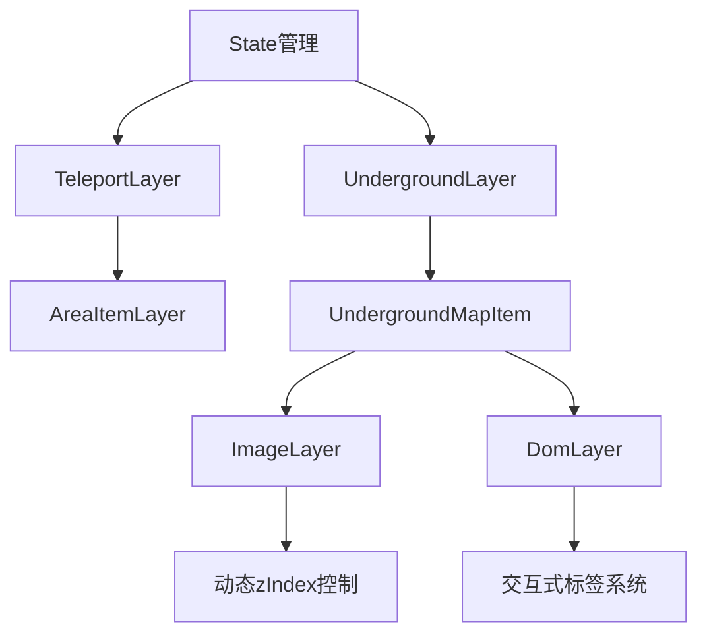

# 空荧酒馆原神地图

超级丝滑的原神地图，数据来源：[空荧酒馆](https://yuanshen.site/docs/)。

在线链接：

- https://qiuxiang.github.io/ky-genshin-map/ (github pages)
- https://ky-genshin-map-1253179036.cos-website.ap-nanjing.myqcloud.com (腾讯云 COS)


### 移动端适配

在手机浏览器也能保证流畅体验。

https://github.com/qiuxiang/ky-genshin-map/assets/1709072/193c2ed9-2cce-44d5-9fbe-5979c6a9a0f1

## 构建

```bash
# 初始化
pnpm run init

# 开发
pnpm run dev

# 编译
pnpm run build
```

## TODO

- [x] 和原神内置的分层地图一样，对同层的点位特别标记
- [ ] 完善各地区/子地区地名显示
- [x] 存档数据导入/导出


陈俊豪 任务：
    对下面功能进行bug排查和英文注释翻译

    1. ActiveMarkerLayer（激活标记图层）
    功能：显示用户当前选中的标记点及其详情信息。

    加载并展示指定的标记图标（active-marker.png）

    显示标记的标题、内容、图片等信息

    支持“未完成 / 已完成”状态切换（使用 Valtio 管理状态）

    2. AreaItemLayer（区域点图层）
    功能：展示地图上的所有资源点或特殊位置。

    要求：

    按区域类型和地下/地上分类渲染 marker

    使用 MarkerLayer 显示点位，支持图标和地下标识

    排除当前激活点与已完成点（可配置）

    3. AreaNamesLayer（区域地名图层）
    功能：在地图上显示主要/次级区域的中文地名标签。

    根据缩放等级动态显示/隐藏不同层级地名

    使用 TextLayer 加载自定义字体渲染中文文本

    支持主区域和子区域名称列表的管理


    宋治钱 

     我做的是[components]和[drawer]的前三部分 [components] 
    里面的内容是它实现了一个图形化的切换开关，通常用于在两种状态之间进行切换，比如开启或关闭某个功能 [drawer][area-item-types.tsx]功能是它们用于渲染和管理一个区域项类型的列表。

    这些组件通常用于构建用户界面，其中用户可以查看和选择不同的区域项类型 [area-items.tsx]允许用户通过点击来激活或取消激活整个分组的区域项。 提供视觉反馈，通过背景颜色和文本颜色的变化来指示区域项的激活状态。
    
     显示区域项的名称和数量，帮助用户识别和管理不同的区域项。
      [index.tsx]提供一个可展开和收起的侧边栏，用户可以通过点击切换按钮来控制其显示状态。 侧边栏内部可以包含各种内容，如区域项类型列表，用户可以在其中进行选择和操作


覃冰棱
我做的是index.tse到shadow-layer。tex的解释
index.这段代码实现了一个《原神》游戏地图的可视化组件，使用 CanvasKit 进行高效渲染地图基础渲染
使用 CanvaskitMap 作为地图容器
通过 TileLayer 加载并显示地图瓦片
支持地图的平移和缩放交互
分层渲染系统
采用分层的架构设计，不同元素位于不同层级
通过 zIndex 控制各层的显示顺序
动态内容管理
从全局状态 store 获取地图数据和配置
动态渲染活动区域项目 (activeAreaItems)
2.mask-layer.这段代码实现了一个黑色半透明的遮罩层，主要用于在地图上创建视觉遮罩效果
遮罩效果实现 创建一个覆盖整个地图区域的黑色半透明矩形层级管理
继承自基础 Layer 类
设置 zIndex 为 underground ，确保显示在基础地图之上但低于其他内容层
3 settings 这段代码是一个React组件，其功能是创建一个设置面板，允许用户通过开关（Switch）来控制一些功能的开启或关闭
这个Settings组件提供了一个设置面板，用户可以通过三个开关来控制以下功能的开启或关闭：
分层地图：控制分层地图功能是否开启。
传送点：控制传送点功能是否可见。
已标记：控制已标记内容是否可见
这个组件可能用于一个地图应用或类似的应用程序中，允许用户自定义地图上显示的内容，
4 shadow-layter 这段代码定义了一个自定义的阴影图层，并将其封装为一个React组件（ShadowLayer）
用于在地图上绘制一个渐变阴影效果  


覃旗广
我做的是state.ts到underground-layer.tsx的解释
state.ts这段代码实现了一个交互式地图应用的核心状态管理和交互功能，主要作用如下：
1.全局状态管理。作用：使用valtio创建响应式全局状态，管理地图实例、视图状态和用户数据
2.地图事件处理。作用：处理地图加载完成事件和点击事件，维护地图实例和交互状态
3.标记管理系统。作用：实现标记的收藏/取消功能，使用localStorage持久化存储用户数据
4.数据导入导出。作用：提供用户标记数据的导出为JSON文件，以及从JSON文件导入功能
5.地下地图联动。作用：当点击包含地下层信息的标记时，自动切换显示对应的地下地图
6.视图控制。作用：提供对地下层、传送点等地图要素的显示控制
另外两段代码共同构成了一个游戏地图系统的核心可视化组件，主要实现以下功能：
1. **多层地图渲染系统**
- `TeleportLayer` 处理地表传送点（含七天神像特殊标记）
- `UndergroundLayer` 管理地下城地图的层级结构
- 实现地表与地下地图的无缝切换（通过`undergroundEnabled`状态控制）
2. **智能显示控制**
- 基于缩放级别（`zoomLevel`）的渐进式加载：
  - 七天神像在 zoom < -4 时隐藏
  - 普通传送点在 zoom < -2 时隐藏
  - 地下地图标签在 zoom < -2 且非激活状态时隐藏
- 视觉强调机制：
  - 当前选中地下地图（`current`）会高亮显示（zIndex+1）
  - 非活跃地下层会半透明化（opacity: 0.3）
3. **交互式地图标记系统**
- 分类处理不同类型的传送点（七天神像 vs 普通传送点）
- 地下地图标签的点击交互（点击切换当前活跃层）
- 动态状态管理（通过valtio的useSnapshot实现响应式更新）
4. **性能优化设计**
- 使用`useMemo`缓存地图块和标签的渲染结果
- 按需渲染机制（`teleportVisible`控制传送点显隐）
- 虚拟DOM层管理（通过`DomLayer`组件）
5. **视觉层次管理**
- 精确的zIndex控制（`zIndex.underground`基础层级）
- 遮罩层（`MaskLayer`）实现地图切换时的视觉过渡
- 响应式样式（通过classNames动态应用CSS类）
典型工作流程：
1. 用户缩放地图时，自动计算合适的显示内容
2. 点击传送点可激活关联的地下地图（通过`activateMarker`）
3. 地下地图界面显示分层标签，点击可切换不同层级
4. 系统自动处理：
   - 不同缩放级别下的元素显隐
   - 活跃层的高亮强调
   - 非活跃层的视觉降级

技术架构特点：

两段代码共同构建了一个具有专业级性能优化和用户体验的游戏地图系统，特别适合处理开放世界游戏中的复杂空间数据可视化需求。


许家伦
对area-picker.tsx的解释
加载并显示标记图标（图片）
通过 <MarkerLayer> 把当前激活的标记点（activeMarker）渲染在地图上。
显示弹窗（MarkerInfo）
当有激活标记点时，显示一个弹出窗口，展示其标题、内容、图片（如有），并可能提供“已完成 / 未完成”按钮。
支持标记状态切换（mark / unmark）
允许用户点击按钮，把该标记点设置为“已完成”或“未完成”，用 valtio 状态管理。
根据条件隐藏按钮
对某些特殊区域（在 borderlessNames 列表中）或刷新时间不为 0 的标记点，不显示标记按钮。

对index.tsx的解释
初始化并渲染主应用界面 Main，其中包括地图（GenshinMap）、区域选择器（AreaPicker）、侧边栏（Drawer）。
在地图数据加载前显示启动画面（splash screen）。
监听右键菜单和点击事件，自动关闭弹窗 UI（如点击地图时关闭选择器和抽屉）。
使用 valtio 获取响应式全局状态 store。


